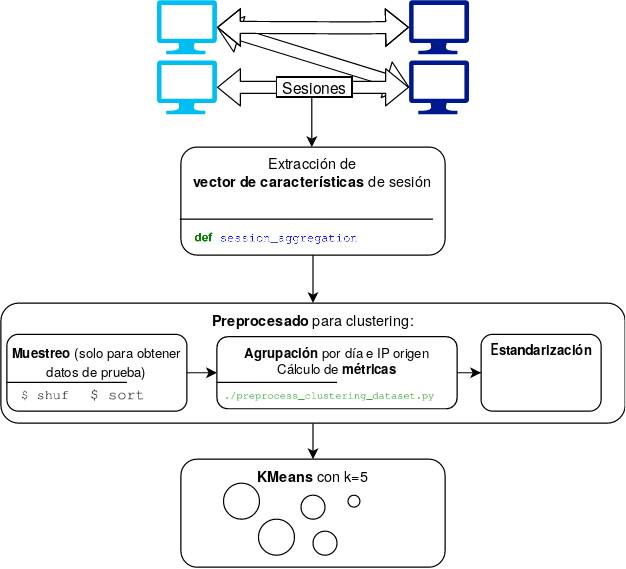
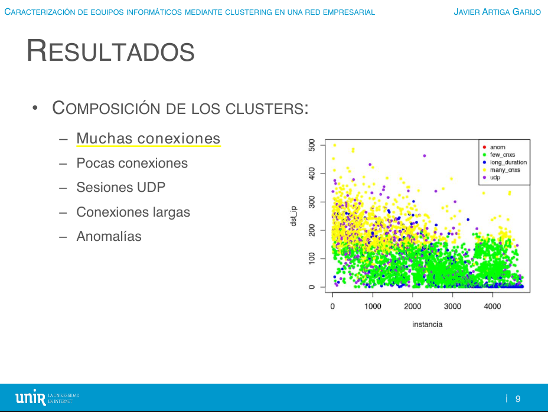
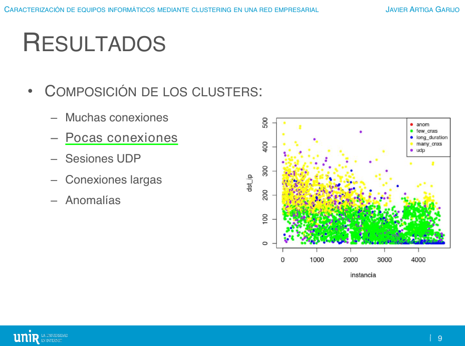
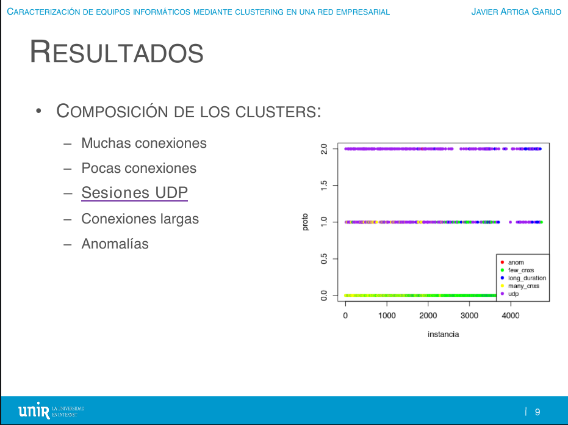
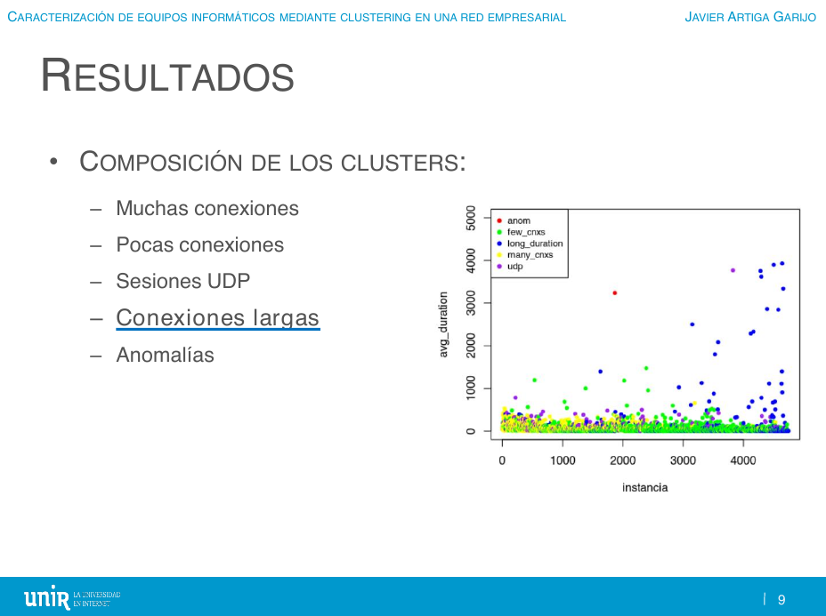
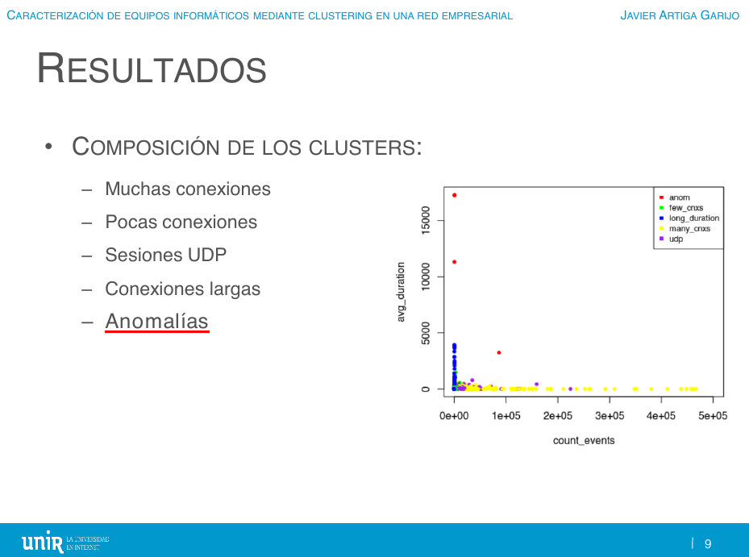
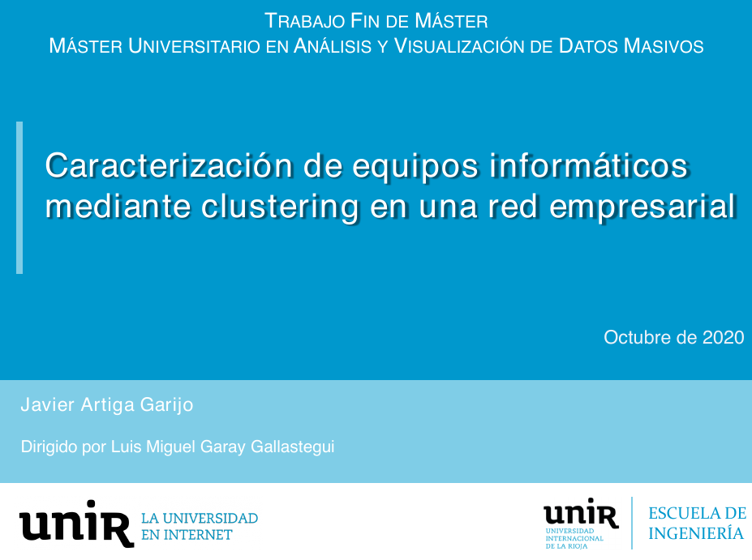

# Caracterización de equipos informáticos mediante clustering en una red empresarial

> En la monitorización de redes informáticas a gran escala, resulta de alto interés
conocer el comportamiento de sus equipos finales y detectar aquellos que puedan
ser sospechosos. Sin embargo, clasificar a cada equipo según su actividad supone
un importante ejercicio de síntesis. Además, es difícil obtener unas categorías
útiles, sobre todo en el caso de las anomalías, ya que son desconocidas a priori.
El presente trabajo aborda este reto haciendo uso de técnicas de clustering a
partir de logs extraídos de firewalls. Con un muestreo del 5 %, que supone un
millón de sesiones al día, se han distinguido 5 clases de comportamientos. Los
comportamientos anómalos se han conseguido reunir en un solo cluster con menos
de diez casos al día.

Para enterarte bien de todos los detalles, mejor leer la [memoria en pdf](TFM.pdf), pero este README ya te da una idea.

# Índice general

## 1. Introducción

La monitorización de la red informática en una gran empresa es un problema complejo por muchos factores. El más inmediato podría ser el alto volumen de conexiones que se producen, superior a varios millones diarios. Pero se suman otras muchas dificultades a la hora de procesar el tráfico de forma que se obtenga información útil para el analista y, en última instancia, para el cliente final: la gran variabilidad de comportamientos, la complejidad de sintetizar lo importante sin perder exactitud, el compromiso entre rapidez en la respuesta y certeza en su fiabilidad, el desconocimiento a priori de cómo se caracteriza un comportamiento anómalo, etc.

Interesa buscar una solución a estos obstáculos porque las empresas quieren garantizar que los recursos de sus redes se gestionan de la manera más óptima posible. Además, es especialmente importante la seguridad de la red corporativa, esto es, protegerla de acciones no autorizadas u otras amenazas que puedan comprometer su disponibilidad o la integridad de los equipos que la componen.

Equipos de seguridad como puedan ser los firewalls contribuyen de manera decisiva a esta protección, pero su funcionamiento basado en firmas no cubre todos los casos ante una intrusión. Sin embargo, sí generan una enorme cantidad de datos que, si se tratan adecuadamente, sirven para ampliar el alcance de las técnicas empleadas en materia de seguridad.

Por ello, un sistema que modele el comportamiento normal de una red y detecte anomalías usando métodos estadísticos y de inteligencia artificial permitirá conocer mejor el contexto de dicha red e identificar comportamientos sospechosos que no se considerarían de otro modo.

Las cuestiones planteadas para guiar esta investigación han sido:
* Si podemos clasificar las direcciones IP de una gran red empresarial en categorías relevantes según su comportamiento de red
* Cuáles serían esas categorías
* Si sereremos capaces de identificar comportamientos sospechosos en base a esta clasificación

A través de estas cuestiones se inicia el estudio del problema, para cuya solución se propone obtener un modelo clasificador que distinga patrones de comportamiento normales y desviaciones respecto de la actividad normal. Este clasificador se realizará mediante una técnica de aprendizaje automático no supervisado como es el clustering (técnica que lleva a cabo una agrupación en categorías de manera natural, buscando características en común sin haber definido las clases previamente).
El objetivo principal es localizar en la red interna orígenes de tráfico catalogable como extraño, lo que puede indicar un equipo infectado o mal configurado. La determinación de qué se sale de lo habitual dependerá de las particularidades de la red, algo difícil de concretar a priori y más aún de generalizar, razón por la cual el clustering (como etapa final tras un análisis y preprocesado de los datos adaptado al caso) se ha considerado una técnica idónea en esta tarea.

## 2. Objetivos y metodología

## 3. Estado del arte

Referencias interesantes:

### 3.1. Aprendizaje automático en la clasificación de tráfico

["A survey of techniques for internet traffic classification using machine learning" (H.T. Nguyen y G. Armitage, 2008)](https://doi.org/10.1109/SURV.2008.080406)

["Why Should Machines Learn?" (S. Herbert, 1983)](https://doi.org/10.1007/978-3-662-12405-5_2)

["Issues and future directions in traffic classification" (A. Dainotti, A. Pescape y K.C. Claffy, 2012)](https://doi.org/10.1109/MNET.2012.6135854)

["Experiences of Internet traffic monitoring with tstat" (A. Finamore et al., 2011)](https://doi.org/10.1109/MNET.2011.5772055)

["BLINC: Multilevel Traffic Classification in the Dark" (T. Karagiannis, K. Papagiannaki y M. Faloutsos, 2006)](https://doi.org/10.1145/1090191.1080119)

### 3.2. Detección de anomalías sobre actividad de red

["A Survey on Big Data for Network Traffic Monitoring and Analysis", (A. D'Alconzo et al., 2019)](https://doi.org/10.1109/TNSM.2019.2933358)

["A Comprehensive Survey on Machine Learning for Networking: Evolution, Applications and Research Opportunities", (R. Boutaba et al., 2018)](https://doi.org/10.1186/s13174-018-0087-2)

["Anomaly-based network intrusion detection: Techniques, systems and challenges", (P. García-Teodoro, 2009)](https://doi.org/10.1016/j.cose.2008.08.003)

["Intrusion Detection: A Survey", (A. Lazarevic, 2005)](https://doi.org/10.1007/0-387-24230-9_2)

### 3.3. Clustering

["Intrusion Detection with Unlabeled Data Using Clustering" (L. Portnoy, 200)](https://doi.org/10.7916/D8MP5904)

["A clustering-based method for unsupervised intrusion detections" (S. Jian et al., 2006)](https://doi.org/10.1016/j.patrec.2005.11.007)

["Flow Clustering Using Machine Learning Techniques" (A. McGregor et al., 2004)](https://doi.org/10.1007/978-3-540-24668-8_21)

["Automated traffic classification and application identification using machine learning" (S. Zander, T. Nguyen y G. Armitage, 2005)](https://doi.org/10.1109/LCN.2005.35)

["Traffic Classification on the Fly" (L. Bernaille et al., 2006)](https://doi.org/10.1145/1129582.1129589) y [conti](https://doi.org/10.1145/1368436.1368445)-[nuaciones](https://doi.org/10.1007/978-3-540-71617-4_17)

"Unsupervised Anomaly Detection in Network Intrusion Detection Using Clusters" (K. Leung y C. Leckie, 2005)

["Next Generation Intrusion Detection Expert System (NIDES) Statistical Algorithms Rationale and Rationale for Proposed Resolver" (H. Javitz et al., 1993)](https://doi.org/10.13140/RG.2.1.1847.9521)

["Network Anomaly Detection: Methods, Systems and Tools" (M.H. Bhuyan, 2014)](https://doi.org/10.1109/SURV.2013.052213.00046)

["Unsupervised clustering approach for network anomaly detection" (I. Syarif et al., 2012)](https://doi.org/10.1007/978-3-642-30507-8_7)

["Computational Complexity between K-Means and K-Medoids Clustering Algorithms for Normal and Uniform Distributions of Data Points" (T. Velmurugan y T. Santhanam, 2010)](https://doi.org/10.3844/jcssp.2010.363.368)

["Distance-Based Outlier Detection: Consolidation and Renewed Bearing" (G. H. Orair et al., 2010)](https://doi.org/10.14778/1920841.1921021)

## 4. Desarrollo

Preprocesado con este [script](scripts/preprocess_clustering_dataset.py), ensayos en [bigml/](bigml/).

## 5. Resultados

[Centroides](https://github.com/jartigag/tfm-clustering/tree/master/bigml#centroides) con K-Means (k=5) sobre los datos de prueba, [análisis de silueta](https://github.com/jartigag/tfm-clustering/blob/master/scripts/CLUSTERING3-silhouette.ipynb).

En septiembre/octubre se llevó el prototipo al escenario real. Se [adaptaron los scripts](scripts/realtime/) y se obtuvieron las mismas 5 categorías:

1. En los equipos que corresponden a la categoría "**comportamiento normal con muchas conexiones**", el número de direcciones IPs destino únicas a las que se conectan está en el orden de varios cientos y casi siempre 2 puertos destino (los más frecuentes, 80 y 443) o 3.

2. Los equipos de categoría "**comportamiento normal, pocas conexiones**" se conectan a
decenas de IPs destino, usando menos de 100 puertos origen y hacia 1-2 puertos destino.

3. En los clasificados como "**sesiones UDP**" lo más destacado es que la característica "protocolo" es mayor que 1, lo que significa que se usa UDP de forma notable (a diferencia de las categorías de comportamiento normal anteriores, donde este valor es más cercano a 0). También suele haber más de 2 puertos destino y las sesiones son más largas de media que las de las categorías anteriores.

4. La cuarta categoría suele identificarse como "**conexiones largas**" porque la duración media de sesión está en el orden de decenas e incluso centenas de miles de segundos (esto es, mantienen sesiones que superan el día de duración).

5. En el grupo denominado de las "**anomalías**", los valores son más extraños porque se compone de pocas instancias cuyas características son más extremas. Lo que más salta a la vista es que el número de eventos en estos casos es mucho mayor, y también el número de puertos origen (lo que indica que estos equipos mantienen una cantidad de sesiones mayor que el resto).

## 6. Conclusiones y líneas futuras

* Podemos clasificar las direcciones IP de una gran red empresarial en categorías relevantes según su comportamiento de red.
* Los equipos de la categoría "anomalías" ciertamente se identifican con comportamientos sospechosos (aunque no necesariamente malintencionados).
* Esta aportación puede tener una aplicación práctica inmediata.

# Presentación de la defensa

